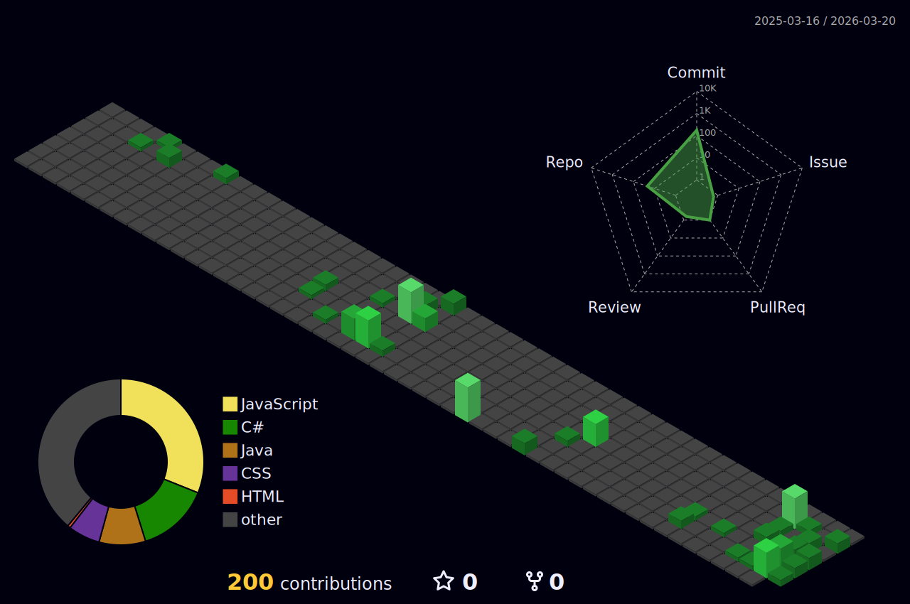

<h1 align="center">Matheus Matos</h1>

  Estudante de Programação · Desenvolvedor Back-end (C#, Java e JavaScript)

 

---

    
  

<!--  -->

---

## Sobre

* **Foco:** Estudante de programação focado em desenvolvimento de sistemas **Back-end**.
* **Linguagens Principais:** Tenho conhecimento adquirido em **Java**, **C#** e o framework **.NET**.
* **Banco de Dados:** Conhecimento em **MySQL**.
* **Novos Desafios:** Atualmente, estou me aventurando no **JavaScript** para expandir minhas habilidades no desenvolvimento web.
* **Objetivo:** Aplicar os conhecimentos técnicos adquiridos para criar soluções eficientes e inovadoras.

## Conhecimentos Técnicos

    
     
    

## Projetos em Destaque

* [NOME DO SEU PROJETO 1](LINK_PARA_O_SEU_PROJETO_1) – *Breve descrição do que o projeto faz (ex: Sistema de Gerenciamento de Estoque).*
* [NOME DO SEU PROJETO 2](LINK_PARA_O_SEU_PROJETO_2) – *Breve descrição do que o projeto faz (ex: Aplicação Web Simples usando JS).*

## Contato

* [**LinkedIn**](https://www.linkedin.com/in/SEU_LINKEDIN_AQUI/)
* [**GitHub**](https://github.com/SEU_USERNAME_AQUI)
* [**Email**](mailto:SEU_EMAIL_AQUI)
* [**Portfólio**](LINK_PARA_SEU_PORTFOLIO)

---

> Busco usar a tecnologia para realizar aquilo que me move: Criatividade, Resolução de Problemas e Curiosidade.

<!--

## Bem-vindo ao meu universo de código e tecnologia👋

`Olá, me chamo Matheus, sou programador de sistemas voltado para Back-end. Busco usar a tecnologia para realizar aquilo que me move: Criatividade, Resolução de Problemas e Curiosidade, além de aplica-la como ferramenta para criar soluções eficientes e inovadoras.`

`Explore meus repositórios e descubra como aplico tudo isso na tecnologia.`

 `• 💼 Atualmente trabalho como Aux. de faturamento, porém estou em busca da minha primeira oportunidade na área da programação;`                                               
 `• 🤓 Desenvolvedor de sistemas voltado para Back-end;`                                                                                                                        
 `• 💻 Atualmente mais focado em:`                                                                                                                                                          

     &nbsp;&nbsp;
    &nbsp;&nbsp; &nbsp;&nbsp;
    &nbsp;&nbsp; &nbsp;&nbsp;
 

##

#### Meu Linkedin:

##

##

#### Projetos Relevantes:

  <a href="https://github.com/matheus-souza-matos/PI-SENAC-VsControl">
   &nbsp;&nbsp; PI-Senac_VsControl
  </a>
 
    <a href="https://github.com/matheus-souza-matos/Projeto_Jogo">
   &nbsp;&nbsp; Projeto_Jogo_Número_Secreto
  </a>
 
    <a href="https://github.com/matheus-souza-matos/Projeto_ValorNotaHp">
    &nbsp;&nbsp; Projeto_Valor_Nota_HP
  </a>
  

-->
