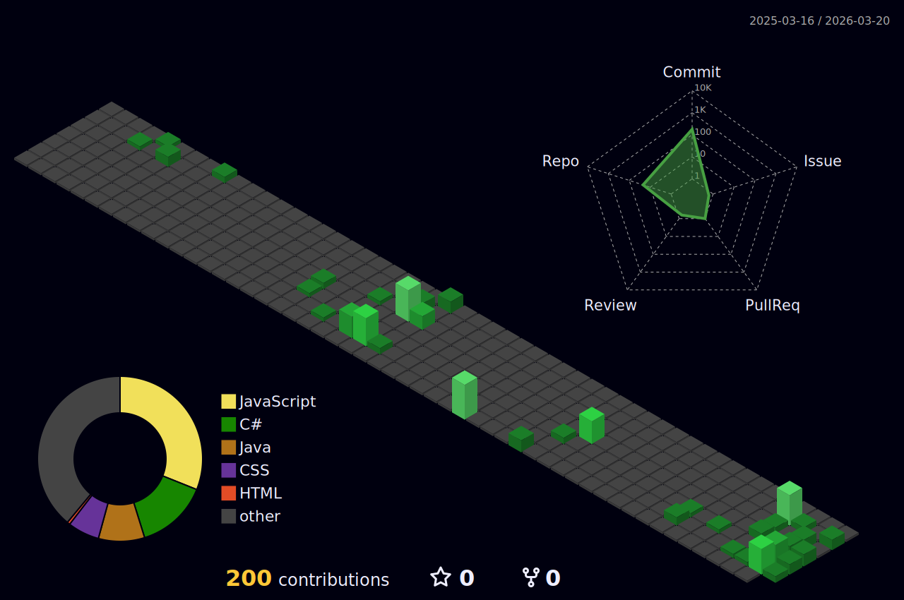

---

<h2 align="center">Sobre mim</h2>

* **Foco:** Estudante de programação focado em desenvolvimento de sistemas **Back-end**.
* **Linguagens Principais:** Tenho conhecimento adquirido em **Java**, **C#** e o framework **.NET**.
* **Banco de Dados:** Conhecimento em **MySQL**.
* **Novos Desafios:** Atualmente, estou me aventurando no **JavaScript** para expandir minhas habilidades no desenvolvimento web.
* **Objetivo:** Aplicar os conhecimentos técnicos adquiridos para criar soluções eficientes e inovadoras.

---

<h2 align="center">Conhecimentos Técnicos</h2>

    
     
    

---
<h2 align="center">Estatísticas:</h2>

    
   

<!--  -->

---

## Projetos em Destaque

* [PI-Senac: VsControl](https://github.com/matheus-souza-matos/PI-SENAC-VsControl) – *Sistema de gestão e controle de estoque - Projeto desenvolvido como conclusão do curso Desenvolvedor de Sistemas - Linguagem: C#.NET*
* [Jogo - Número Secreto](https://github.com/matheus-souza-matos/Projeto_Jogo) – *Um jogo simples de adivinhação com feedbacks de dicas para cada palpite, com limites de erros para aumentar o desafio. - Linguagem: JVA*
* [Valor Nota HP](https://github.com/matheus-souza-matos/Projeto_ValorNotaHp) – *Sistema criado para reduzir a margem de erro dos cálculos de impostos na emissão de nota fiscal de onde trabalho - Linguagem: JAVA*

## Contato

  
---

> Busco usar a tecnologia para realizar aquilo que me move: Criatividade, Resolução de Problemas e Curiosidade.

<!--

## Bem-vindo ao meu universo de código e tecnologia👋

`Olá, me chamo Matheus, sou programador de sistemas voltado para Back-end. Busco usar a tecnologia para realizar aquilo que me move: Criatividade, Resolução de Problemas e Curiosidade, além de aplica-la como ferramenta para criar soluções eficientes e inovadoras.`

`Explore meus repositórios e descubra como aplico tudo isso na tecnologia.`

 `• 💼 Atualmente trabalho como Aux. de faturamento, porém estou em busca da minha primeira oportunidade na área da programação;`                                               
 `• 🤓 Desenvolvedor de sistemas voltado para Back-end;`                                                                                                                        
 `• 💻 Atualmente mais focado em:`                                                                                                                                                          

     &nbsp;&nbsp;
    &nbsp;&nbsp; &nbsp;&nbsp;
    &nbsp;&nbsp; &nbsp;&nbsp;
 

##

#### Meu Linkedin:

##

##

#### Projetos Relevantes:

  <a href="https://github.com/matheus-souza-matos/PI-SENAC-VsControl">
   &nbsp;&nbsp; PI-Senac_VsControl
  </a>
 
    <a href="https://github.com/matheus-souza-matos/Projeto_Jogo">
   &nbsp;&nbsp; Projeto_Jogo_Número_Secreto
  </a>
 
    <a href="https://github.com/matheus-souza-matos/Projeto_ValorNotaHp">
    &nbsp;&nbsp; Projeto_Valor_Nota_HP
  </a>
  

-->
